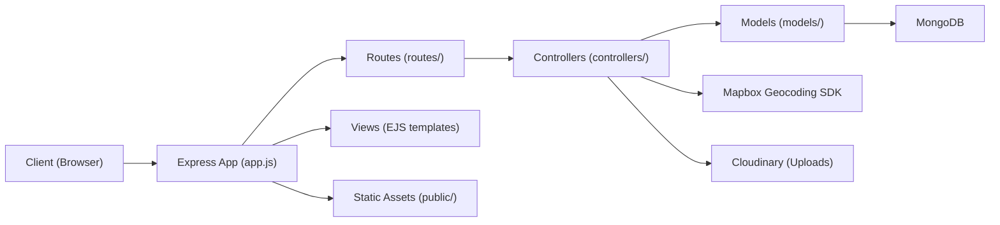

## Wanderlust — Travel Listings Platform

A full-stack Node.js application for discovering and managing travel listings. Users can create, view, edit, and delete listings, leave reviews, and see geocoded locations on maps. Images are stored on Cloudinary, and locations are enriched using Mapbox Geocoding.

### Overview / Introduction

Wanderlust helps users explore and manage travel destinations. It includes authentication, map-based geocoding, image uploads, and a clean MVC structure with EJS views.

- **Purpose**: Showcase listings with images, locations, and reviews
- **Why it’s useful**: A solid base for travel apps, rentals, or any listing-centric platform
- **Audience**: Developers and learners building full-stack apps with Node.js, Express, and MongoDB

## Features

- **Listings CRUD**: Create, read, update, delete listings with EJS-based views
- **Reviews**: Add reviews with author relationships and validation
- **Authentication**: Local strategy with sessions and flash messages
- **Geocoding**: Mapbox geocoding to enrich locations with coordinates
- **Image Storage**: Cloudinary integration via Multer storage adapter
- **Validation & Errors**: Server-side validation and robust error handling
- **Modular Architecture**: Clean MVC with routes, controllers, and models

## Project Architecture

- **Express server** using EJS templates
- **MongoDB** with Mongoose models
- **Controllers** handle business logic and integrate with services (Mapbox/Cloudinary)
- **Static assets** served from `public/`
- **Seed script** to initialize DB with geocoded listings



- Controllers like `controllers/listings.js` coordinate listing CRUD, geocode lookups, and view rendering
- `cloudConfig.js` configures Cloudinary for image storage
- Sessions and authentication use `express-session`, `passport`, and `passport-local`

## Installation & Setup

### Prerequisites

- Node.js 18+
- MongoDB running locally (default URL: `mongodb://127.0.0.1:27017/wanderlust`)
- Cloudinary account (for image storage)
- Mapbox account and access token (for geocoding)

### 1) Clone and install

```bash
git clone <your-repo-url>
cd MajorProject
npm install
```

### 2) Environment variables

Create a `.env` file in the project root:

```bash
# Mapbox
MAP_TOKEN=your_mapbox_access_token

# Cloudinary
CLOUD_NAME=your_cloudinary_cloud_name
CLOUD_API_KEY=your_cloudinary_api_key
CLOUD_API_SECRET=your_cloudinary_api_secret

# Optional
PORT=8080
```

Notes:

- The app reads `MAP_TOKEN` for geocoding in both the app and seed script
- Cloudinary credentials are required for image handling

### 3) Seed the database (optional, recommended for demo)

This will insert sample listings and geocode their locations. Ensure MongoDB is running and your `.env` is set.

```bash
node init/index.js
```

### 4) Run the app

```bash
# Development (with reload)
npm run dev

# Production
npm start
```

The server runs on `http://localhost:8080` by default.

## Usage

- Visit `http://localhost:8080`
- Browse listings: `/listings`
- Create a listing: `/listings/new` (requires login)
- View a listing: `/listings/:id`
- Edit/Delete listing: `/listings/:id/edit` (owner-only)
- Add a review: `/listings/:id/reviews` (requires login)

Authentication uses sessions and local strategy. Flash messages display success/error states for interactions like create, update, delete.

## Tech Stack

- **Backend**: Node.js, Express
- **View Engine**: EJS + EJS-Mate layouts
- **Database**: MongoDB + Mongoose
- **Auth**: Passport (Local Strategy), `express-session`, `connect-flash`
- **Validation**: Joi
- **File Uploads**: Multer + `multer-storage-cloudinary`
- **Cloud Storage**: Cloudinary
- **Geocoding**: Mapbox SDK
- **Utilities**: Method-Override, Cookie-Parser
- **Dev**: Nodemon

## Contributing

Contributions are welcome!

1. Fork the repository
2. Create a feature branch: `git checkout -b feature/your-feature`
3. Commit changes: `git commit -m "Add your feature"`
4. Push to branch: `git push origin feature/your-feature`
5. Open a pull request with a clear description

Please follow existing code style and structure (controllers, routes, models, views). Add validation and error handling where appropriate.

## License

MIT License — add your `LICENSE` file or update this section to your preferred license.


